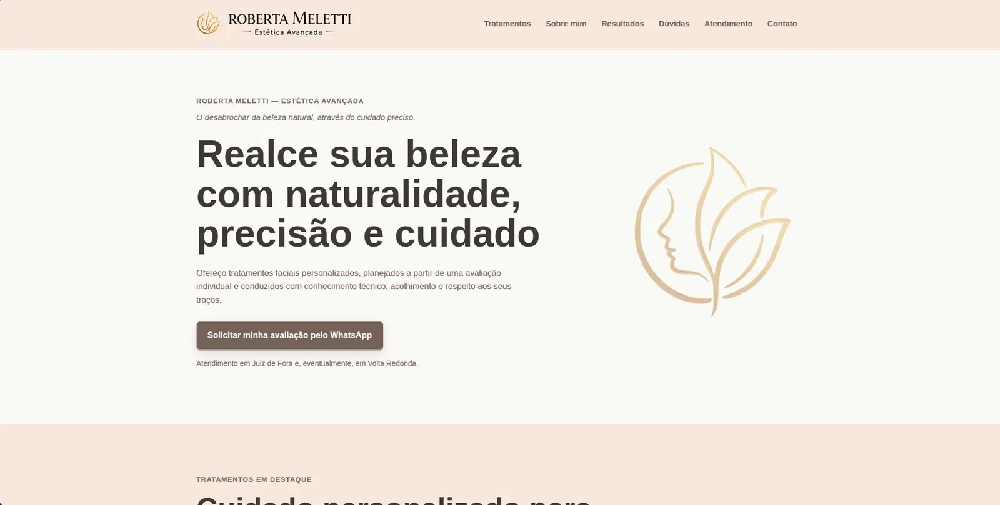
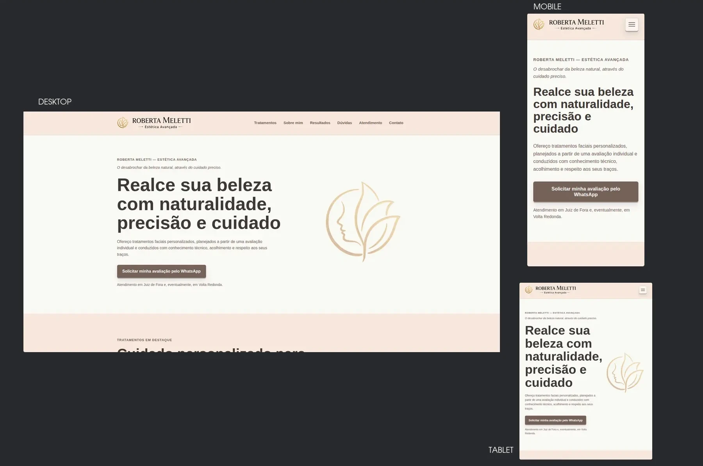

# Roberta Meletti — Landing Page

Landing page institucional desenvolvida para **Roberta Meletti — Estética Avançada**, com foco em apresentar seu trabalho, transmitir confiança e converter visitantes em contatos pelo WhatsApp.

**Site publicado:** [robertameletti.com.br](https://robertameletti.com.br/)



## Sobre o projeto

Este é um projeto real, criado a partir do levantamento de necessidades da cliente e de um escopo definido para uma página única, clara e responsiva.

A solução reúne informações sobre tratamentos, perfil profissional, registros de procedimentos, resultados autorizados, depoimentos, dúvidas frequentes e locais de atendimento. A experiência foi orientada a uma ação principal: solicitar uma avaliação individual pelo WhatsApp.

A arquitetura foi mantida propositalmente simples e adequada ao produto: HTML, CSS e JavaScript, sem framework, banco de dados ou etapa de build.

## Principais recursos

- Layout mobile-first adaptado para celular, tablet e desktop
- Menu responsivo com navegação por âncoras
- CTAs para WhatsApp com mensagens pré-preenchidas
- Apresentação de tratamentos, credenciais, resultados e depoimentos
- FAQ interativo com abertura controlada
- Visualizador ampliado de imagens e vídeo
- Controles personalizados de reprodução e expansão do vídeo
- Botão de retorno ao topo
- Navegação por teclado, foco visível e suporte a preferência por movimento reduzido
- SEO essencial e metadados Open Graph para compartilhamento social
- Imagens e vídeos otimizados para uso na web

## Responsividade



A interface foi construída com abordagem mobile-first e ajustada para preservar hierarquia, legibilidade e identidade visual nos diferentes tamanhos de tela.

## Tecnologias

- HTML5 semântico
- CSS3 modularizado por responsabilidade
- JavaScript Vanilla
- Git e GitHub
- Cloudflare Pages

## Publicação

O site está publicado no Cloudflare Pages com domínio próprio e HTTPS. As variantes com `http` e `www` são direcionadas para o endereço canônico:

```text
https://robertameletti.com.br/
```

O domínio também utiliza DNSSEC para autenticação das respostas DNS.

## Processo de desenvolvimento

O projeto foi conduzido desde o levantamento de requisitos e a definição do MVP até a implementação, validação funcional e publicação.

O trabalho foi organizado em mudanças incrementais, branches, commits e pull requests. As verificações incluíram comportamento responsivo, navegação por teclado, links do WhatsApp, interações da interface, mídias e inspeção no navegador com DevTools.

Ferramentas de IA apoiaram o planejamento, a implementação, a depuração e a documentação. O uso desse apoio foi combinado com controle de escopo, revisão de alterações e testes manuais no navegador.

## Executando localmente

O projeto não requer instalação de dependências nem processo de build.

```bash
git clone https://github.com/MTaranto/roberta-meletti-landing-page.git
cd roberta-meletti-landing-page
```

Depois, abra a pasta no Visual Studio Code e execute o `index.html` com a extensão **Live Server**.

## Evolução planejada

Como etapa separada da entrega inicial, está planejada a inclusão de testes end-to-end com Cypress e execução automatizada pelo GitHub Actions.

## Autor

**Márcio Taranto Nogueira**

Responsável pelo levantamento de requisitos, definição do escopo, direção visual, condução do desenvolvimento, validação funcional e publicação.

- [GitHub](https://github.com/MTaranto)
- [LinkedIn](https://www.linkedin.com/in/mtaranto/)
